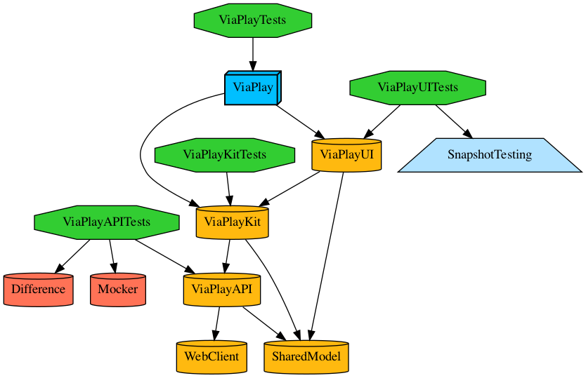
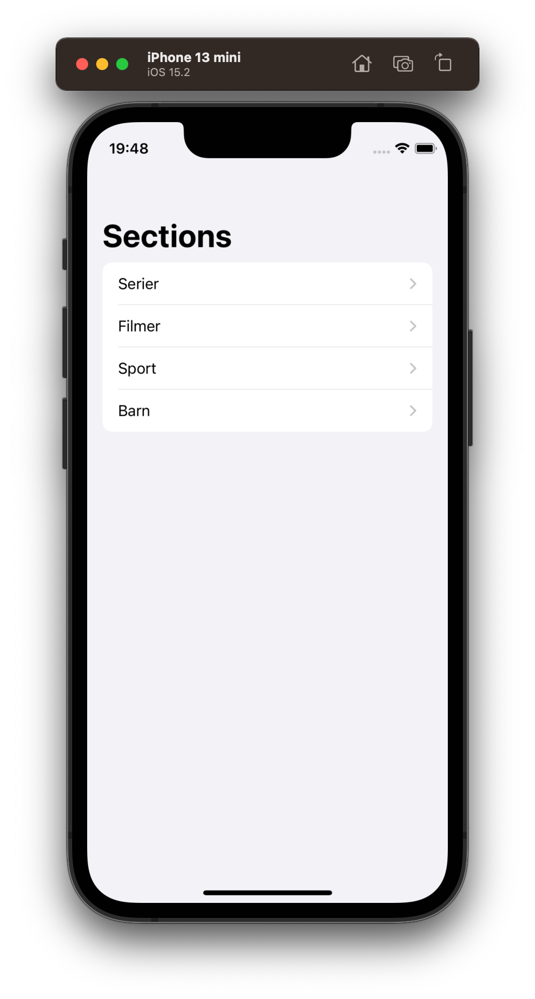
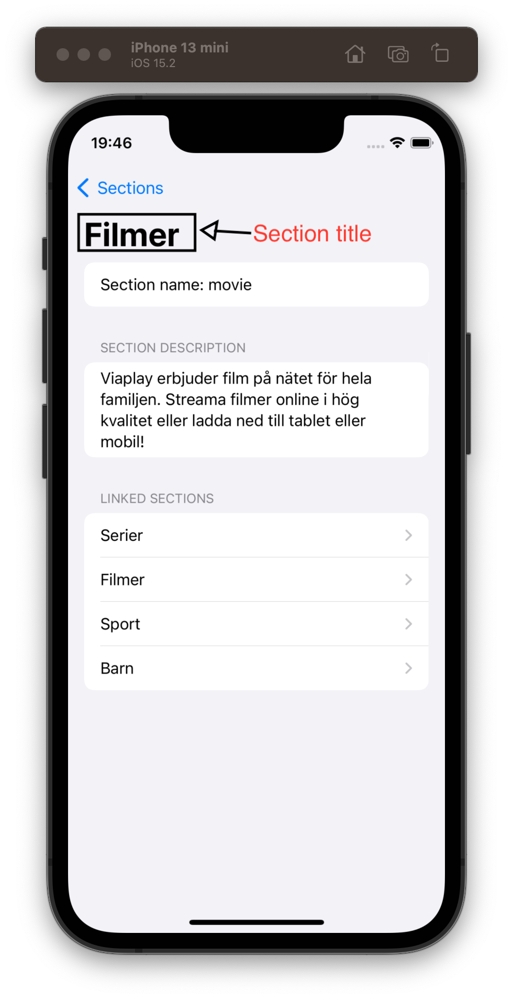

[](https://tuist.io)

# Viaplay 

This is an example app following the specs defined on the following:

## Work Sample - Navigating Viaplay's API

> We use an API with a dynamic structure. Here is the API endpoint for iOS devices:
https://content.viaplay.se/ios-se
Use the array of sections returned by the API in viaplay:sections to create a simple app that presents
> these sections to the user. The user should also be able to navigate to these sections, you can use
> the href string for this purpose. Use the properties title and description from API responses to let the
user know which page they are currently viewing.

### Requirements

- [x] The user should be able to navigate to all sections returned from the API
- [x] The user should be able to see the title and description of the page they have navigated to
- [x] The app should work online and offline

### **Points to consider**

- The API contains a lot of data! We are only interested in the sections, page title and
description in this work sample.

- The API is templated with a dtg-parameter to indicate if a client is looking for downloadable content, you can ignore this flag by removing it. (example:
https://content.viaplay.se/ios-se/serier{?dtg} becomes https://content.viaplay.se/ios-se/serier)

- We are not expecting a fancy GUI.

## 🛠 How to run?

This project is using [tuist](https://github.com/tuist/tuist) to manage the xcode project generation and to help with the modularization of the project.
Moreover, it is also using [carthage](https://github.com/Carthage/Carthage) due to one dependency, be sure to install as well.

Before running the project we have to generate the xcode project.

### 🏗 How to generate the project?

First, be sure you have tuist installed on your environment.
The recommended way, is to run the following command:

```bash
curl -Ls https://install.tuist.io | bash
```

After successfully install tuist, you can run the following command

```bash
tuist generate
```

## How to edit the project settings?

Just use tuist with the following command

```bash
tuist edit
```

Then, change the configuration.

## Points to evolve the project

- [ ] Write more tests
- [ ] Write UI tests
- [ ] Fix previews for each views
- [ ] Improve Screenshot tests for all views


## Generate Dependencies Graph?

You can use tuist to generate a graph

```bash
$ tuist graph
```

The current graph



## Screenshots





## Screenshots tests

Be aware that you should choose the iPhone 13 mini with iOS 15.2 to be able to run the screeshot tests.

Like the comment added on the screenshot test file 

```
// Run this test with iPhone 13 mini
// iOS 15.2
// Otherwise the test will break
```